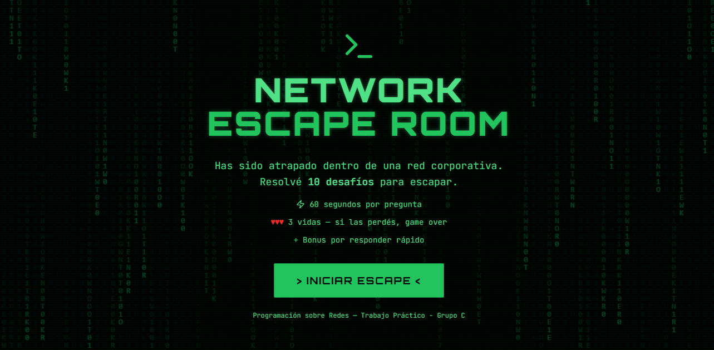
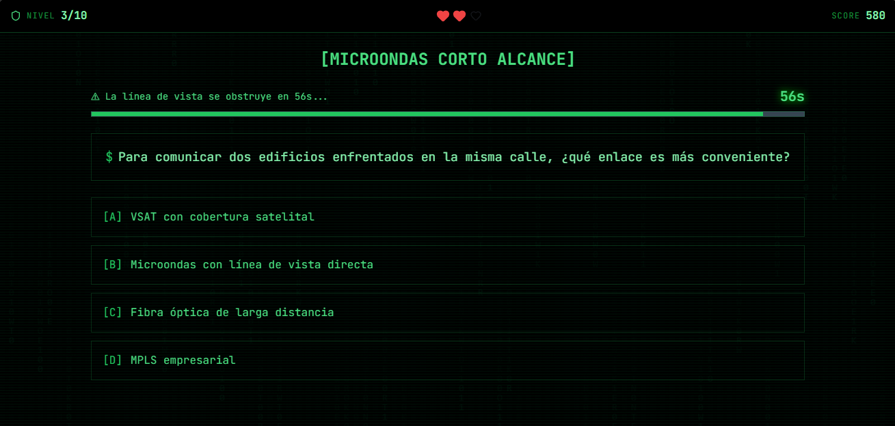
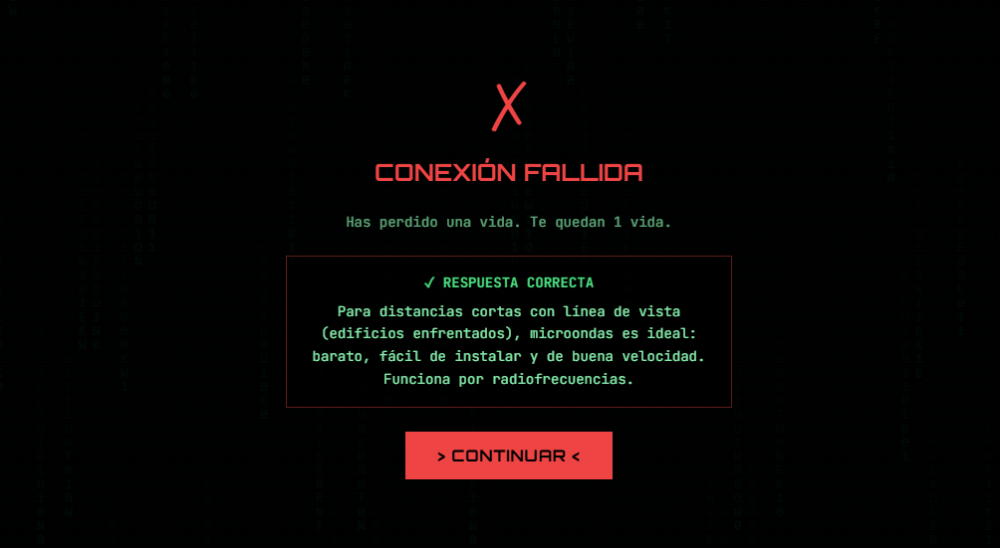
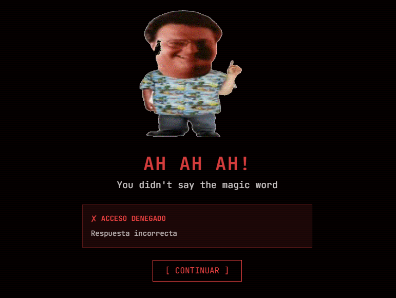
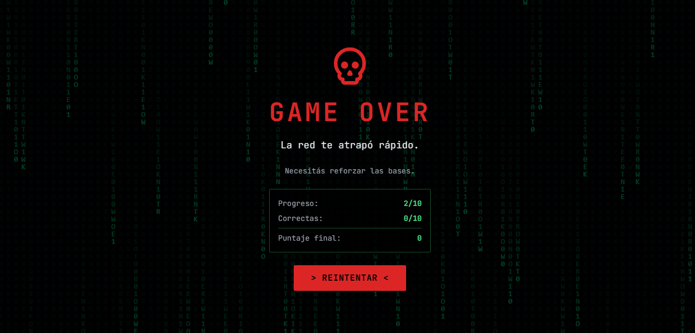

# NETWORK ESCAPE ROOM

**"Has sido atrapado dentro de una red corporativa. Resuelve los desafíos para escapar."**

Una aplicación interactiva de aprendizaje gamificado sobre redes y ciberseguridad, diseñada con una estética de terminal hacker.

---

## Vista Previa

*Vista previa del flujo principal del juego.*

---

## Características Principales
* **Desafíos Técnicos:** 10 niveles que cubren temas como Modelo OSI, Protocolos (STP, TCP/IP) y Topologías.
* **Gamificación Real:** Sistema de vidas (3), temporizador de 60 segundos y bonos por velocidad.
* **Feedback Hum some:** Integración de memes icónicos (Jurassic Park, Spider-Man, Toy Story) para las respuestas incorrectas.
* **Audio Inmersivo:** Banda sonora dinámica de AC/DC y asistente virtual JARVIS al finalizar con éxito.
* **Diseño Responsive:** Interfaz inspirada en la "Matrix" con lluvia de código y efectos neón.

---

## Tecnologías Utilizadas
* **React.js** - Estructura de la aplicación y hooks.
* **Tailwind CSS** - Estilos y diseño "Hacker UI".
* **Framer Motion** - Animaciones y transiciones de pantalla.
* **Lucide React** - Iconografía técnica.
* **TanStack Query** - Gestión de estados y navegación.

---

## Galería del Proyecto

A continuación, se muestran las diferentes interfaces del sistema de escape:

| Pantalla de Inicio | Desafío Técnico | Feedback de Nodo |
|:---:|:---:|:---:|
|  |  |  |

 

| Respuesta Incorrecta | Estadísticas Finales |
|:---:|:---:|
|  |  |

---

## Instalación y uso Local
Si deseas ejecutar este proyecto localmente:

### Requisitos Previos
* **Node.js:** Debes tener instalada la versión **18.0.0** o superior. [Descargar Node.js](https://nodejs.org/).
* **npm:** El gestor de paquetes de Node (viene incluido con Node.js).
* **Git:** Para clonar el repositorio en tu máquina.

### Pasos a seguir

* **Clonar el repositorio:**
   * Abre la consola de comandos o tu ide favorito y ejecuta el siguiente comando:
   * git clone [https://github.com/ElisaMele/Programacion-sobre-redes-Grupo-C]
   * cd [Programacion-sobre-redes-Grupo-C]
   * Instalar dependencias: **npm install**
   * Inicia el servidor de desarrollo local con el comando: **npm run dev**
   * Una vez que el servidor esté corriendo, abre tu navegador y accede a la termnal (http://localhost:8080)

---

# 💀 ¡QUE COMIENCE EL JUEGO!
*Haz clic abajo para entrar en la red*

[**ENTRAR AL NODO**]([https://reto-redes-ifts.netlify.app/])

